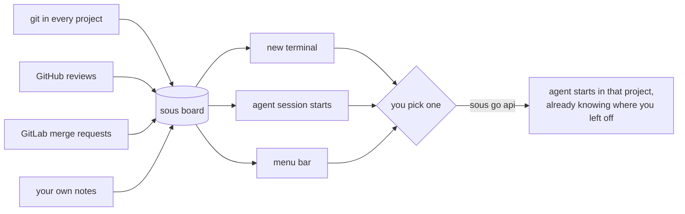
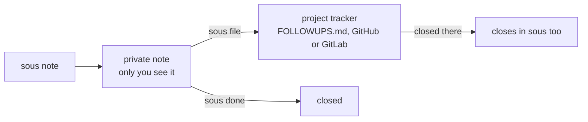

# sous

[](https://github.com/bilal-/sous/actions/workflows/ci.yml)
[](https://github.com/bilal-/sous/releases/latest)
[](LICENSE)
[](go.mod)
[](https://axi.md)

One list of what is waiting on you, across every project you work on.

AI tools make it easy to keep ten or twenty projects moving at once. The hard
part is keeping track of them. Which project has a review waiting for me?
Where did I leave off in this one? What did I promise to come back to?

`sous` answers those questions in one place. It shows up on its own when you
open a terminal or start a Claude Code or Codex session, so it still works on
the days you forget it exists.

```
sous · 2 on you · 1 on others · 3 unfinished

  on you
  s:0b4ac59dfd33  app-next           review requested · PR #14 json api            2d
  1               billing            send the pricing copy to Sam                  6d

  on others
  2               mobile-app         waiting on app store review                   4d

  unfinished
  s:fe9c4922caf6  chime              6 commits unpushed · main                     6d
  s:4515743b9362  audio-app          11 files uncommitted · feat/history           3mo

  26 checked · 0 unavailable · as of 09:02 · sous snooze <id> to hide a row
```

**On you** is what needs you: reviews people asked you for, and notes you
marked as yours. **On others** is what you are waiting for. **Unfinished** is
work you left behind in git: uncommitted files, unpushed commits, stashes.
Every row says how long it has been waiting.

## Why it matters

You already have places that track work: GitHub, GitLab, issue trackers, a
notes app, your own memory. Each one knows a slice, and each one has to be
opened to be useful. The work that slips is the work nobody reminds you
about: the review someone asked for on Tuesday, the branch you never
pushed, the "I'll fix that later" from a project you have not opened in two
weeks.

sous pulls those slices into one list and puts it where you already look:
your terminal and your AI agent. You do not have to remember to check it.



### A few days with sous

**Monday morning.** You open a terminal and the board is already there:
two reviews waiting on you, a note you left on Friday, and a branch in a
project you forgot about with six unpushed commits. You pick the review,
type `sous go app-next`, and your agent starts in that project with a
summary of where things stand.

**In the middle of something else.** You are deep in the API and remember
the billing page needs new copy. Instead of switching, you type
`sous note -p billing -k me "update the pricing copy"` and keep going. It
will be on the board tomorrow.

**Waiting on someone.** You sent a design to Sam for sign off. You note it
with `-k them`. It sits under "on others" with a growing age, so you notice
when it has been a week and it is time to nudge.

**Coming back after two weeks.** You open a project you have not touched
in a while and run `sous here`: the branch, the last commit, how your last
agent session ended, and the ideas you left for later. Five seconds instead
of twenty minutes of digging.

**Your agent keeps notes for you.** In Claude Code you say "remind me to
write the migration test for billing". The agent runs `sous note` for you.
It never files anything where others can see without asking first.

**Friday.** `sous report --week --open` shows what you closed, where you
spent your time, and what is still waiting.

### Notes stay yours until you share them



### Who it is for

* You work across many projects, often with AI agents, and lose track of
  what is waiting where.
* You live in the terminal, or at least start your agents from one.
* You want a nudge, not another tool to manage.

It is probably not for you if you mostly work in one project, or if your
team already runs everything through one tracker that you check every day.

## What sous is, and is not

sous is an index, not a tracker. Your work stays where it already lives: in
git, on GitHub or GitLab, or in a project's own `FOLLOWUPS.md`. sous keeps
pointers and short notes of your own, and works everything else out again
each time you look.

It has no priorities, due dates, assignees or sprints. Age is the only order.
It needs no API key and runs no background service. When you want an AI to
help, the agent you already use calls `sous` like any other command. It can
hand a task to an agent that works in the background, and keeps track of
it, but it never becomes the thing that does the work: that is the job of a
runner.

The full design is in [docs/design.md](docs/design.md).

## What works today

sous is young. Here is an honest list.

| Works today | Not yet |
|---|---|
| macOS and Linux, on Intel and Apple silicon | Windows |
| the board in new **zsh**, **bash** and **fish** shells | other shells (run `sous --ambient` from their startup file) |
| session hooks for **Claude Code** and **Codex**; the sous skill for them and for **Gemini CLI, Kimi, Cursor, Antigravity** and other agents that read `~/.agents/skills` | session hooks for other agents (see below) |
| git: uncommitted files, unpushed commits, stashes, branches with no upstream | |
| **GitHub**: reviews asked of you, changes asked on your pull requests, failing checks on your pull requests, unread notifications that mention or assign you; filing and closing issues | CI on branches without a pull request |
| **GitLab**: merge requests to review, yours awaiting review; filing and closing issues | GitLab to do items |
| `FOLLOWUPS.md` in the project as a simple tracker | Jira, Linear, Gitea, Bitbucket (plugins welcome) |
| handing a task to **Claude Code** or **Codex** in the background, in its own git worktree, and following it on the board | runs that survive a restart, retries and reviews (a runner plugin's job) |
| a menu bar view through [SwiftBar](https://swiftbar.app) on macOS | a Linux tray icon |
| plugins in any language, on a contract that only grows until 1.0 | a contract frozen for good (that is what 1.0 means) |
| install by script, Homebrew or from source | Windows, other package managers |

## Install

**On macOS or Linux**, run:

    curl -fsSL https://raw.githubusercontent.com/bilal-/sous/main/install.sh | sh

That downloads the latest release, checks it against its checksum, puts
`sous` in `~/.local/bin`, and sets everything up (see below). If `~/.local/bin` is not on
your `PATH`, the script tells you. To install a particular version, run
`curl ... | SOUS_VERSION=v0.1.0 sh`. To put `sous` somewhere else, set
`SOUS_BIN` the same way.

**With Homebrew** (macOS or Linux):

    brew install bilal-/tap/sous && sous setup

**From source**, with Go 1.27 or newer:

    git clone https://github.com/bilal-/sous && cd sous
    make install && sous setup

You need `git`. For GitHub, install [`gh`](https://cli.github.com) and run
`gh auth login` (for notifications, a classic token with the notifications
scope: `gh auth refresh -s notifications`). For GitLab, install [`glab`](https://gitlab.com/gitlab-org/cli)
and run `glab auth login`. Both are optional. sous uses your existing logins
and never asks for a token.

To remove sous, delete:

* `~/.local/bin/sous` (or `brew uninstall sous`) and `~/.sous`
* the `sous` skill folders in `~/.claude/skills`, `~/.codex/skills`,
  `~/.agents/skills` and `~/.gemini/antigravity/skills`
* the `sous hook` entries in `~/.claude/settings.json` and
  `~/.codex/hooks.json`
* the `# sous:` comment and the line under it in your shell's startup
  files (for fish, the file `~/.config/fish/conf.d/sous.fish`)
* the `sous` folder in your cache folder (`~/Library/Caches/sous` on macOS,
  `~/.cache/sous` on Linux)
* if you handed work to agents: their branches, named `sous/run-<n>`, in
  those projects (`git branch -D sous/run-7`), then `git worktree prune`
  there once `~/.sous` is gone

## Setting up

There is nothing else to do: installing runs `sous setup`, which

* finds your projects by looking in the usual places (`~/code`, `~/src`,
  `~/projects`, `~/workspace`, `~/Developer` and a few more). It looks two
  folders deep, so `~/code` finds `~/code/acme/api`.
* adds session hooks for Claude Code and Codex, and the `sous` skill for
  them and for any agent that reads the shared `~/.agents/skills` folder
  (Gemini CLI, Kimi, Cursor and others) or Antigravity's
* adds one line to your shell's startup file (zsh, bash or fish), so new
  terminals show the board
* writes a menu bar script for [SwiftBar](https://swiftbar.app)

It tells you what it did. Open a new terminal and the board is there.

If something looks wrong later (a `?` in the headline, an agent that
does not know sous), run `sous doctor`. It checks every part of the setup,
including your GitHub and GitLab logins, and says the command that fixes
anything that is not right.

If your projects live somewhere else, say where:

    sous setup ~/where/my/repos/are

Name more than one folder if you like. `sous setup` is safe to run again at
any time. Add `--no-shell` if you would rather not have your shell's startup
file touched.

## Everyday workflows

### Start your day

Open a terminal. The board prints from a cache, so it appears instantly, and
refreshes in the background when it gets old. Run `sous` to see it fresh.

Pick something and go there:

    sous go api

This starts your agent in the project, with a short summary of where you
left off already in its context. In zsh, with the shell snippet
installed, your terminal is in the project too when the agent exits. Use `-a codex` to pick
a different agent.

### Pick up where you left off

    sous here

In any project, this shows the branch, the last commit, how your last agent
session ended, open notes and ideas for this project, and anything waiting on
you. Agent sessions get the same summary when they start, without you asking.

### Catch a thought before it slips away

You are deep in one project and remember something about another. Write it
down without leaving:

    sous note -p billing -k me "send the pricing copy to Sam"

`-p` finds the project by a rough name. If the name matches more than one
project, sous lists them and asks you to be specific. It never guesses.

`-k` says whose move it is. Use `me` for your job and `them` when you are
waiting on someone. Leave it out for an idea, which stays off the main board
and shows up when you next open that project.

You can also just ask your agent: "sous, note for billing that I owe Sam the
numbers." The skill points it at sous, and sous itself shows it how.

### Share a note with the team

Notes are private to you until you choose otherwise. When a note should live
in the project's tracker, file it:

    sous file 3

sous puts it where the project already keeps work: `FOLLOWUPS.md` if the
project has one, then GitHub issues, then GitLab issues. From then on, sous
checks that item each time it builds the board. Close it there, by ticking
the box or closing the issue, and it closes in sous too.

To close both at once from your side:

    sous done 3 --close

Plain `sous done 3` only closes your note. Nothing reaches a shared tracker
unless you ask.

### Quiet the noise

A row you know about but cannot act on yet:

    sous snooze 3 2              hide note 3 for two days
    sous snooze s:fe9c4922caf6   hide a git or GitHub row until it changes

### Look back on your week

    sous report --week --open

This opens a simple page in your browser: what is new on you, what got
closed, which projects you worked in, and what needs a look. Plain
`sous report` shows what changed since your last report, right in the
terminal.

### Hand work to an agent

Tell your agent what you want done, and let it hand the task off:

> "Have an agent fix the flaky test in billing. It fails about one run in
> five since the fixtures changed."

Your agent runs `sous go billing --run -` with a full brief. An agent
starts on it in the background, in its own git worktree, so your checkout
is never touched, and the board shows it:

    on others
      7    billing    running · fix the flaky test          4m

Later, when you open a new session, your agent hears it first:

    [sous] Runs waiting on the user:
      7 billing: needs you · which fixture should win? · answer with: sous reply 7 "<answer>"

You answer in plain words, your agent runs `sous reply 7 "…"`, and the run
carries on. When it is done, the board says `run done, review it` with the
branch to look at, or says the changes are waiting, not yet committed, in
its worktree. The run never pushes. When you are finished with it,
`sous done 7 --clean`.

## Use it with your AI agent

sous is a plain command, so any agent that can run shell commands can use
it. What differs is how much is set up for you.

**Claude Code.** `sous setup` adds two hooks. When a session starts in a
project, the agent is shown where you left off. When it ends, sous remembers
the session's last message for next time. The `sous` skill tells Claude
that sous is there and when to use it, and `sous help` teaches it the rest,
so you can say things like:

* "what is waiting on me?"
* "note for billing that I owe Sam the pricing copy"
* "where did I leave off here?"
* "have an agent fix the flaky test in billing"

Claude asks before anything reaches a shared tracker.

**Codex.** The same skill, and a hook when a session starts. Newer Codex
versions also report when a session ends: run
`sous setup --codex-session-end` and `sous here` shows how your last Codex
session ended, as it does for Claude Code. Without it, `sous here` still
shows the last commit and your notes.

**Gemini CLI, Kimi, Cursor, Antigravity and others.** Many agents now
read skills from a shared folder, `~/.agents/skills`, and `sous setup` puts
the sous skill there, and in Antigravity's own folder when Antigravity is
installed. These agents then know sous is there and when to use it. What
they do not get yet is the start of session summary, because sous only
installs hooks for Claude Code and Codex. To get it, add a line to the
agent's instructions file (such as `AGENTS.md` or `GEMINI.md`) asking it to
run `sous here --brief` at the start of a session.

For an agent that reads no skills folder, `sous setup --print-skill` prints
the skill so you can paste it into its instructions.

If you get sous working well with another agent, please share how in an
issue, or send a pull request adding hooks for it.

## All commands

The full guide, with every option, is [docs/commands.md](docs/commands.md).
Every command that shows something also takes `--json`, and every command
explains itself with `--help`.

| Command | What it does |
|---|---|
| `sous` | the board for all your projects |
| `sous <folder>` | the board for just the projects in that folder |
| `sous <project>` | where you left off in that project |
| `sous here` | where you left off in this project |
| `sous projects [name]` | every project sous can see |
| `sous note [-p project] [-k me\|them\|idea] [--file] "text"` | write a note |
| `sous edit <n> "text"` | change a note |
| `sous kind <n> me\|them\|idea` | change whose move it is |
| `sous snooze <n\|s:id> [days]` | hide a row for a while |
| `sous show <n>` | one note in full; for a run, how it is going |
| `sous done <n> [--close] [--clean]` | close a note, and with `--close` its tracker item too; `--clean` removes a run's worktree |
| `sous file <n> [--force]` | send a note to the project's tracker |
| `sous report [--week] [--open]` | what changed lately |
| `sous go <project> [-a agent]` | start your agent in a project |
| `sous go <project> --run <brief>` | hand a task to an agent in the background |
| `sous reply <n> "answer"` | answer a run that needs you |
| `sous setup [folder...]` | set everything up; folders say where your projects are |
| `sous config [key value...]` | see or change settings |
| `sous doctor` | check the setup, and how to fix what is not right |

To write a note that starts with a dash, put `--` before it:
`sous note -- "-2 tests failing"`.

Exit codes: `0` fine, `1` something failed, `2` the command was wrong or a
name was ambiguous, `3` asked for the cached board before there was one, or
a runner is not set up.

## How sous stays honest

* **Missing data never looks like zero.** If GitHub could not be reached or
  a folder is missing, the headline says `? on you (github failed)` instead of
  a calm zero, and what sous knew before is kept and marked `(stale)`.
* **Nothing is made up.** Apart from your notes, every row comes from git or
  a tracker, checked again on each look. sous remembers only when it first saw
  each row, so an age means "waiting since", not "noticed at".
* **The tracker wins.** If an item you filed is closed where it lives, your
  note closes too, marked as closed upstream. If sous cannot check, the row
  says so.
* **Starting a session is always fast.** `sous here`, the session hooks and
  `sous go` never wait on the network.

## Configuration

Change settings with `sous config` (see
[the command guide](docs/commands.md#sous-config)), or edit
`~/.sous/config.toml` by hand:

```toml
roots = ["~/code"]             # where your projects live
ignore = ["scratch/*"]         # folders to skip
agent = "claude"               # the agent sous go starts
refresh_hours = 4              # how old the shell's cached board may get
run_minutes = 60               # how long a run by a built in runner may take
gitlab_hosts = ["git.example.org"]   # GitLab servers, beyond the ones glab knows
plugins = ["~/.sous/plugins/sous-backend-jira"]   # extra plugins; only listed ones run

[projects."acme/*"]            # every project in the acme folder
github_account = "work-account"

[projects."acme/billing"]      # one project
backend = "markdown"           # always file to FOLLOWUPS.md here
```

If you use more than one GitHub account, `github_account` picks the one
`gh` should use for those projects.

## Built for people and agents

The same commands serve you in a terminal and an AI agent in a session. sous
follows the [AXI](https://axi.md) guidelines (as of
[this version](https://github.com/kunchenguid/axi/blob/e15f82dd8e75ff640aaefd5c76c49471c5bcbbea/docs/index.html)) for agent friendly command line
tools where they help people too:

* running `sous` with nothing else shows live data, not help
* counts come first, and empty results say so plainly
* output ends with the next command you are likely to want
* errors are clear, nothing ever waits for input, and unknown flags fail
* the agent sees your context when a session starts, and a tiny skill tells
  it sous is there

The command line is the one source of truth. The skill only says when to
reach for sous and to run `sous help`, which lists every command and the
rules for agents (such as asking before anything reaches a shared tracker).
So the skill never needs updating when sous changes.

Output is plain text for people, with `--json` for programs.

## Connectors and plugins

sous grows through small plugins, and we would love your help writing them.
There are four kinds:

* **signals** find things that are waiting on you: pull requests, CI runs,
  calendar holds, tickets
* **backends** are where filed notes go: Jira, Linear, Gitea, Bitbucket,
  plain text files
* **launchers** start an agent or editor in a project
* **runners** do a task in the background and say how it is going: an
  agent on a server, a queue of reviewed changes, orchid

A plugin is any program named `sous-signal-<name>`, `sous-backend-<name>`,
`sous-launcher-<name>` or `sous-runner-<name>`. It reads arguments and standard input and writes
standard output, so you can write one in any language. The built in GitHub,
GitLab and git support go through exactly the same door, so they are good
examples to read.

The quickest start is [the example plugin](examples/sous-signal-todo),
about fifty lines of plain shell. [docs/plugins.md](docs/plugins.md)
explains the contract, which is stable and only grows until 1.0, and
[CONTRIBUTING.md](CONTRIBUTING.md) explains how to send it in. Connectors we
would especially like to see: Jira, Linear, Gitea, Bitbucket, Azure DevOps,
Sentry, and CI status.

## Contributing

sous is a solo hobby project, built in spare time. Bug reports, ideas and
pull requests are all welcome and gladly read. I cannot promise to get to
every one, or to get to it quickly, but I will when time allows. Start with
[CONTRIBUTING.md](CONTRIBUTING.md). The contributor guide for people and
agents working on the code is [AGENTS.md](AGENTS.md).

    make build          # build bin/sous
    make test           # run every test with the race detector
    make ci             # formatting, vet and tests, as CI runs them

## Status

sous is young: version 0.3, still before 1.0. Commands and flags may change
between minor versions, and every change is noted in
[CHANGELOG.md](CHANGELOG.md). Your data files are always carried forward: a
new version upgrades them, and an older version refuses a newer file rather
than damaging it. The plugin contract is stable: until 1.0 it only grows,
and 1.0 freezes it.

## License

sous is released under the [Apache License 2.0](LICENSE).
Copyright 2026 Bilal.

In plain words, you may use, copy, change and share sous, including in paid
and commercial work, as long as you:

* include a copy of the license with it
* keep the copyright and license notices
* say which files you changed, if you share a changed version

The license also gives you a patent grant from everyone who contributes. sous
comes with no warranty. If you send a contribution, you agree it is shared
under the same license, as the license itself describes in section 5. There
is no separate agreement to sign.

This summary is only a guide. The [LICENSE](LICENSE) file is what counts.
