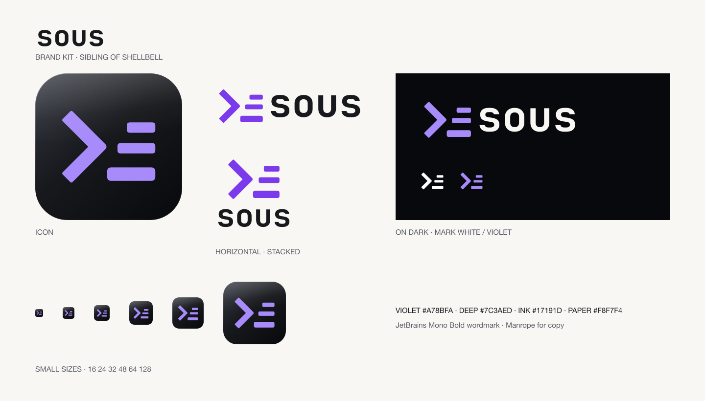

# sous brand kit

The ticket-rail prompt: shellbell's `>_` with two tickets lined up onto the
cursor. Everything waiting, in one list.

<picture><source media="(prefers-color-scheme: dark)" srcset="svg/horizontal-on-dark.svg"></picture>



## A family

sous is a sibling of [shellbell](https://shellbell.dev), and orchid will be the
third. They share one mark language, so they read as a set:

- the same bold `>` chevron and `_` cursor, drawn from the same geometry
- the same glossy ink plate for app icons
- the same lowercase JetBrains Mono Bold wordmark, and Manrope for copy
- one glyph and one colour each: shellbell rings (two rays, amber); sous
  lines up what is waiting (two tickets, violet)

## Pick an asset

| Need | Use |
| --- | --- |
| Main logo | `svg/horizontal-on-dark.svg` or `svg/horizontal-on-light.svg` |
| Symbol, wordmark, stacked logo | `svg/`: four compositions, each on dark, on light, black and white |
| Transparent PNG logos | `png/`: `@1x` is 128px high, `@2x` 256px |
| App icon | `icons/icon-gloss-rounded-1024.png` (flat and square variants beside it) |
| Website icons | `web/`: SVG favicon, 180px touch icon, 16 to 512px PNGs |
| Link preview | `social-card.png`, 1200×630 |

## Colour and type

| Role | Value | Use |
| --- | --- | --- |
| Violet | `#A78BFA` | The mark, on dark |
| Deep violet | `#7C3AED` | The mark, on light |
| Ink | `#17191D` | Wordmark on light, the icon plate |
| Paper | `#F8F7F4` | Wordmark on dark |
| Black / white | `#000000` / `#FFFFFF` | One colour uses |

On the board, colour means something: saffron is on you, violet is on others,
green is done and red is failed. Keep those meanings wherever sous output is
shown.

The wordmark is always lowercase `sous`, in one colour. Its letters are
outlined from JetBrains Mono Bold, so no logo needs a font to display.

## Use

- Keep clear space of at least one cursor thickness around the mark.
- Do not stretch, rotate or recolour parts of it, or move the tickets.
- Use the on-light logos on light backgrounds; never the pale on-dark
  wordmark on white.
- The app icon gets the gloss. Logos, favicons at small sizes and single
  colour uses stay flat.

The name and logo are not covered by the code's MIT License; see
[TRADEMARK.md](../TRADEMARK.md).

## Regenerate

```sh
cd brand/tools
npm install
npm run brand
```

`tools/brand-art.mjs` is the geometry and plate: the chevron, cursor, plate
and gloss are shellbell's own, and the tickets are sous's. `tools/build.mjs`
writes every file here from it. JetBrains Mono Bold (SIL Open Font License
1.1) comes from npm and is used only to outline the wordmark; no font ships
with the logos or with sous. This is the source of truth: the website at
sous.bilal.sh copies its icons from here.
